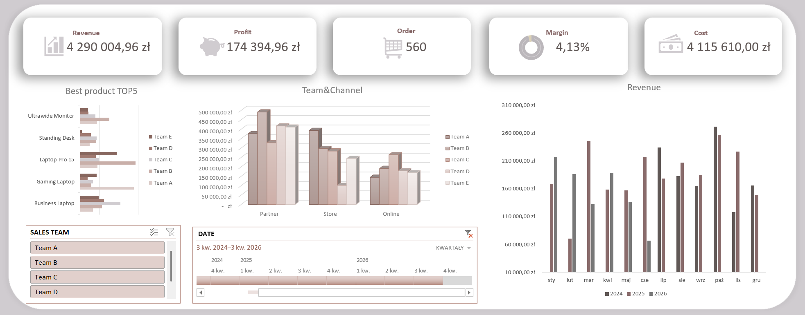

# sales-analysis-excel

## Project Overview
This project presents sales data analysis performed in Microsoft Excel.
The goal was to analyze sales performance, identify trends, and create an interactive dashboard.

## Tools Used
- Microsoft Excel
- Pivot Tables
- Power Query
- Data Cleaning
- Dashboard Design

## Key Insights
- Monthly sales trends
- Best-selling products
- Regional performance analysis

## Dashboard Preview

## Files
- raw dataset - my own data
- sales_analysis.xlsx – final analysis & dashboard
